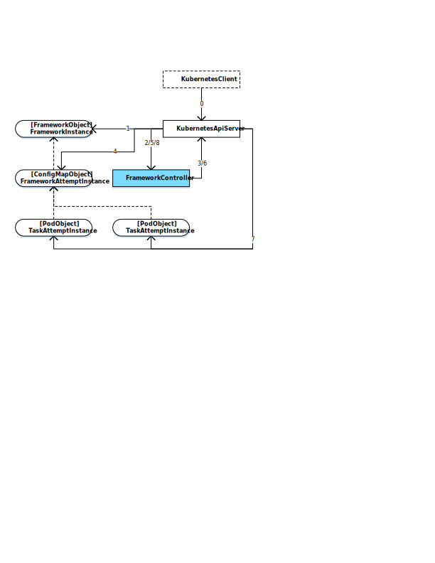

# FrameworkController
FrameworkController is built to orchestrate all kinds of applications on [Kubernetes](https://kubernetes.io) by a single controller.

These kinds of applications include but not limited to:
- __Stateless and Stateful Service__ (Nginx, TensorFlow Serving, HBase, Kafka, etc)
- __Stateless and Stateful Batch__ (KD-Tree Building, Batch Data Processing, etc)
- __Any combination of above applications__ (Distributed TensorFlow Training, Stream Data Processing, etc)

## Why Need It
### Problem
In the open source community, there are so many specialized Kubernetes Pod controllers which are built for a specific kind of application, such as [Kubernetes StatefulSet Controller](https://kubernetes.io/docs/concepts/workloads/controllers/statefulset), [Kubernetes Job Controller](https://kubernetes.io/docs/concepts/workloads/controllers/jobs-run-to-completion), [KubeFlow TFJob Operator](https://www.kubeflow.org/docs/guides/components/tftraining). However, no one is built for all kinds of applications and combination of the existing ones still cannot support some kinds of applications. So, we have to learn, use, develop, deploy and maintain so many Pod controllers.

### Solution
Build a General-Purpose Kubernetes Pod Controller: FrameworkController.

And then we can get below benefits from it:
- __Support Kubernetes official unsupported applications__

   Such as the [Stateful Batch with Service](example/framework/basic/batchwithservicesucceeded.yaml) application, like [Distributed TensorFlow
 Training](https://www.tensorflow.org/deploy/distributed).

- __Only need to learn, use, develop, deploy and maintain a single controller__

- __All kinds of applications can be orchestrated through the same interface with a unified experience__

- __If really required, only need to build specialized controllers on top of it, instead of building from scratch__

   The similar practice is also adopted by Kubernetes official controllers, such as the [Kubernetes Deployment Controller](https://kubernetes.io/docs/concepts/workloads/controllers/deployment) is built on top of the [Kubernetes ReplicaSet Controller](https://kubernetes.io/docs/concepts/workloads/controllers/replicaset).

## <a name="FrameworkInterop">Architecture</a>

  

## Feature
### Framework Feature
A Framework represents an application with a set of Tasks:
1. Executed by Kubernetes Pod
2. Partitioned to different heterogeneous TaskRoles which share the same lifecycle
3. Ordered in the same homogeneous TaskRole by TaskIndex
4. With consistent identity {FrameworkName}-{TaskRoleName}-{TaskIndex} as PodName
5. With fine grained [RetryPolicy](doc/user-manual.md#RetryPolicy) for each Task and the whole Framework
6. With fine grained [FrameworkAttemptCompletionPolicy](doc/user-manual.md#FrameworkAttemptCompletionPolicy) for each TaskRole
7. Guarantees at most one instance of a specific Task is running at any point in time
8. Guarantees at most one instance of a specific Framework is running at any point in time

### Controller Feature
1. Highly generalized as it is built for all kinds of applications
2. Light-weight as it is only responsible for Pod orchestration
3. Tolerate Pod/ConfigMap unexpected deletion, Node/Network/FrameworkController/Kubernetes failure
4. Well-defined Framework consistency, state machine and failure model
5. Idiomatic with Kubernetes official controllers, such as [Pod Spec](https://kubernetes.io/docs/concepts/workloads/pods/pod-overview/#pod-templates)
6. Compatible with other Kubernetes features, such as Kubernetes [Service](https://kubernetes.io/docs/concepts/services-networking/service), [Gpu Scheduling](https://kubernetes.io/docs/tasks/manage-gpus/scheduling-gpus), [Volume](https://kubernetes.io/docs/concepts/storage/volumes/), [Logging](https://kubernetes.io/docs/concepts/cluster-administration/logging)
7. Aligned with Kubernetes [Controller Design Guidelines](https://github.com/kubernetes/community/blob/master/contributors/devel/controllers.md) and [API Conventions](https://github.com/kubernetes/community/blob/master/contributors/devel/api-conventions.md)

## Prerequisite
1. A Kubernetes cluster, v1.10 or above, on-cloud or on-premise.

## Quick Start
1. [Run Controller](example/run)
2. [Submit Framework](example/framework)

## Doc
1. [User Manual](doc/user-manual.md)
2. [Known Issue and Upcoming Feature](doc/known-issue-and-upcoming-feature.md)
3. FAQ
4. Release Note

## Official Image
* [DockerHub](https://hub.docker.com/u/frameworkcontroller)

## Related Project
### Third Party Controller Wrapper
A specialized wrapper can be built on top of FrameworkController to optimize for a specific kind of application:
* [OpenPAI Controller Wrapper](https://github.com/Microsoft/pai) `[Developing]`: A wrapper client optimized for AI applications
* [NNI Controller Wrapper (FrameworkController Training Service)](https://github.com/Microsoft/nni/blob/master/docs/FrameworkControllerMode.md): A wrapper client optimized for AutoML applications

### Similar Offering On Other Cluster Manager
* [YARN FrameworkLauncher](https://github.com/Microsoft/pai/blob/master/subprojects/frameworklauncher/yarn): Similar offering natively supports [Apache YARN](http://hadoop.apache.org)

## Contributing
This project welcomes contributions and suggestions. Most contributions require you to agree to a
Contributor License Agreement (CLA) declaring that you have the right to, and actually do, grant us
the rights to use your contribution. For details, visit https://cla.microsoft.com.

When you submit a pull request, a CLA-bot will automatically determine whether you need to provide
a CLA and decorate the PR appropriately (e.g., label, comment). Simply follow the instructions
provided by the bot. You will only need to do this once across all repos using our CLA.

This project has adopted the [Microsoft Open Source Code of Conduct](https://opensource.microsoft.com/codeofconduct/).
For more information see the [Code of Conduct FAQ](https://opensource.microsoft.com/codeofconduct/faq/) or
contact [opencode@microsoft.com](mailto:opencode@microsoft.com) with any additional questions or comments.
